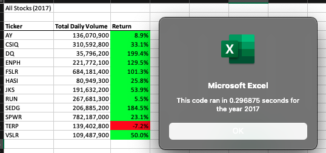
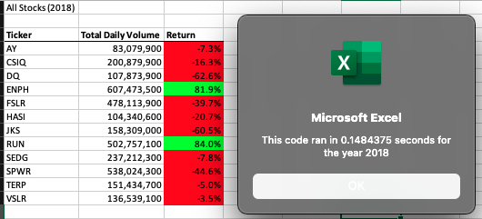

# stock-analysis

# Overview
  The po]int of this project, is to analyze the performance of a dozen stocks during the year of 2017 and 2018. The analyzed data will be demostrated with excel to show which of the dozen stocks had a positive return for the given year. The given code will be refactored to ensure efficiency within the data. 
  
# Results
  In 2017 stocks had a great return, one thrid of the stocks obtained a return greater than 100% that given year. However, during that same year there was one stock (TERP) that had negatilve return that year. The following year did not see as much success as the previous year. In 2018, the data showed that 10 out of the 12 stocks had a negative return. Only two stocks (ENPH and RUN) that had a return and both of them had a return greater than 80%. Giving Steve a better understanding the performance of the past two years. Before refactoring the original script the executiion times would be 1.73 and 1.43 seconds. After refactorting the script, the execution times reduced to under 1 second. 
  

# Summary
  There are several advantages to refactoring code. Which include, making the code easier to understand, making it less complex and easier to maintain. However, the process of refactoring data can be time comsuming and depending the size of the data, it could be difficult to determine where to start refactoring. For this project though, it would benefit Steve if he refactored the data because the data set is small, it will not require too much extra code. While Steve may be getting more efficent outputs for his code, it might take so time to add these additional codes to the original.
